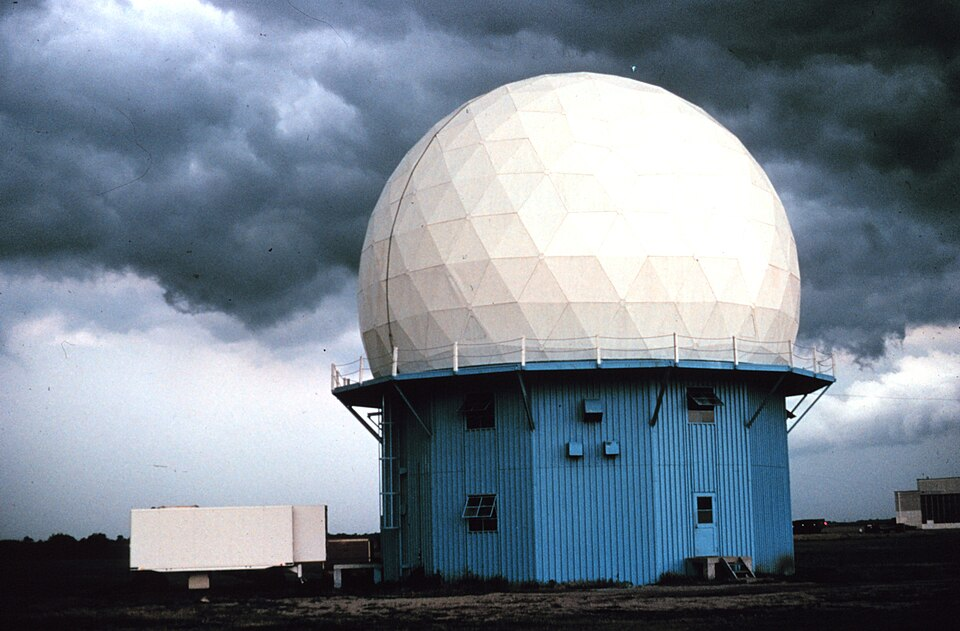

# ERAD2026 Open Radar Science Short Course

This repository contains the hands-on materials for the ERAD 2026 short course Open Radar – Open Source Software Tools for Radar Data Processing: From Raw Data to Analysis-Ready Fields. For a detailed description of the course, including its objectives, agenda, prerequisites, and expected outcomes, please refer to the accompanying .

## Motivation

The course will take place on Saturday, August 22, 2026, two days before the [13th European Conference on RADar in meteorology and hydrology (ERAD2026)](https://www.erad2026.rs/).
The course will discuss the principles of open science and provide an overview of the most mature and exciting software packages available for radar data processing
(ex.
[LROSE](https://github.com/NCAR/lrose-core),
[Py-ART](https://arm-doe.github.io/pyart/),
[BALTRAD](https://baltrad.github.io/),
[wradlib](https://docs.wradlib.org/en/latest/)
) and how they connect with the scientific software stack.

The course will be built with myst Jupyter Notebooks as hands-on approach for interactive user experience. The main course programming language is Python, but also Command Line Tools are used.

The course will also highlight the
[xradar](https://docs.openradarscience.org/projects/xradar/en/stable/)
package, implementing the newly adopted FM301/CfRadial2 WMO standard. The course will also showcase how to harness the power of
[xarray](https://docs.xarray.dev/en/stable/) and [dask](https://docs.dask.org/en/stable/array.html)
for efficient, distributed radar data processing.

The course will cover operational use (e.g. in HPC environments or Cloud Infrastructure) as well as algorithm development, enabling the participants to implement their own algorithms.

The course will also show how to create workflows for different aspects of weather radar
data processing, using open datasets relevant to the attendees and ERAD2026.

## List of Instructors

- Brenda Javornik, NCAR
- Kai Mühlbauer, University Bonn
- Robert Jackson, ANL
- Scott Collis, ANL
- Ting-Yu Cha, NCAR
- tbc.

### Contributors

## Course program

Please see the [preliminary schedule](schedule.md).

## Structure

### Tool Foundations
Content relevant to each of the Open Radar packages (ex. Py-ART, wradlib, LROSE, BALTRAD).

### Example Workflows
Workflows utilizing the various packages and open radar data.

## Things You Need to Prepare
Participants need to bring their own 64-bit notebook (Linux, Windows, Mac). The exercises will take place on a cloud server.
